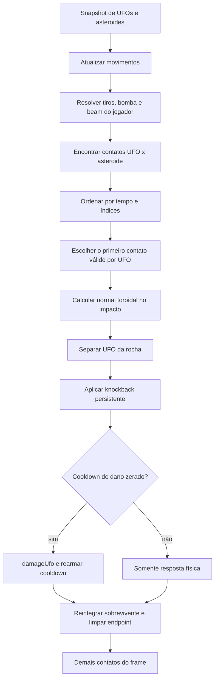

# Arquitetura — colisão entre inimigos e asteroides

Status: especificação revisada e pronta para implementação.

Escopo: item 1 da Fase 1 de `ideias_combate_inimigos.md` — UFOs colidem com asteroides, recebem dano e sofrem knockback.

Baseline antes da implementação: `npm test` passa com 141 testes.

## 1. Objetivo de gameplay

O campo de asteroides deve funcionar como uma peça previsível da arena. O jogador pode conduzir um perseguidor contra uma rocha e entender antecipadamente o resultado:

- asteroides pequenos e médios causam 1 de dano;
- asteroides grandes causam 2 de dano;
- asteroides maiores produzem afastamento mais forte;
- o asteroide não perde HP, não muda de trajetória e não fragmenta pelo choque;
- cada contato físico gera no máximo um impacto, nunca dano a cada frame;
- a mesma regra vale junto às bordas do mundo toroidal.

Essa não será uma simulação newtoniana completa. Tabelas por tamanho são mais fáceis de ler e balancear do que massa, restituição e conservação de momento.

## 2. Decisões fechadas

1. A colisão usa os círculos de `radius`, não a silhueta visual irregular.
2. A detecção é varrida e toroidal com `sweptCircleCollisionTime()`; checar apenas as posições finais não é suficiente.
3. Apenas o UFO é deslocado pelo choque. O asteroide permanece uma peça estável do tabuleiro.
4. O knockback possui velocidade própria e persistente. Ele não é aplicado apenas em `ufo.vx/vy`.
5. Somente o primeiro impacto de cada UFO gera resposta de gameplay em um fixed step: dano, knockback e latch. Uma limpeza geométrica final pode afastá-lo de outras rochas do snapshot sem transformar essas sobreposições secundárias em novos impactos.
6. Um latch por par impede dano repetido pelo mesmo contato; um cooldown global curto evita rajadas de dano por rochas distintas. Separação e knockback continuam sendo respostas físicas.
7. Dano e velocidade relativa de saída dependem somente do tamanho. O impulso corretivo necessário considera as velocidades de entrada para conseguir atingir esse resultado fixo.
8. Matar um UFO com um asteroide concede os pontos normais do UFO e respeita o multiplicador já armado.
9. Uma morte ambiental não incrementa nem reseta o combo de precisão.
10. Ações ofensivas do jogador têm prioridade sobre a colisão ambiental dentro do mesmo fixed step.
11. UFOs devem tentar nascer sem sobrepor asteroides. Um fallback amostrado que ainda sobreponha uma rocha recebe proteção booleana até ficar fisicamente livre.
12. Magma, crio, cristal, gravidade, tiros inimigos e desvio de obstáculos ficam fora desta entrega.

## 3. Diagnóstico da arquitetura atual

O projeto usa factories e objetos mutáveis, não classes. A divisão atual deve ser preservada:

| Responsabilidade | Local atual | Consequência para esta fase |
|---|---|---|
| Configuração e balanceamento | `src/config.js` | Recebe todos os números da colisão |
| Criação e movimento de UFO | `src/entities.js` | Recebe o estado persistente de knockback |
| Regras, dano, score e ordem do frame | `src/game.js` | Detecta e resolve os impactos |
| Geometria toroidal | `src/math.js` | Já oferece tudo; não deve mudar |
| Feedback de hit/morte | `src/renderer.js` | `ufoHit` e `ufoDestroy` já bastam no primeiro corte |

Pontos relevantes nas linhas atuais:

- `createUfo()`: `src/entities.js:325`.
- `updateUfo()`: `src/entities.js:359`.
- `updateUfo()` sobrescreve `vx/vy`: `src/entities.js:373-374`.
- `damageUfo()`: `src/game.js:1133`.
- snapshots de asteroides e UFOs: `src/game.js:1649-1664`.
- velocidade efetiva do UFO após o movimento: `src/game.js:1688-1693`.
- fase de colisões: `src/game.js:1695-1708`.
- colisão varrida toroidal: `src/math.js:54`.

O problema estrutural principal é este:

```text
colisão soma impulso em vx/vy
          ↓
próximo updateUfo recalcula vx/vy = direção × speed
          ↓
knockback desaparece
```

Por isso, a velocidade comandada pela IA e a velocidade causada por impacto precisam ser canais separados.

## 4. Fluxo proposto



Não criar um novo `PhysicsSystem`, `EnemyManager` ou módulo de colisão nesta fase. A regra é pequena e pertence ao mesmo closure de `createGame()` que já centraliza as demais colisões.

## 5. Contrato de configuração

Adicionar dentro de `CONFIG.ufo`:

```js
asteroidCollision: {
  damageBySize: {
    small: 1,
    medium: 1,
    large: 2,
  },
  knockbackSpeedBySize: {
    small: 70,
    medium: 150,
    large: 280,
  },
  hitCooldown: 0.50,
  knockbackDamping: 8,
  maxKnockbackSpeed: 1100,
  separationPadding: 0.5,
  contactReleasePadding: 2,
  spawnClearance: 16,
  spawnAttempts: 24,
},
```

Interpretação:

- `knockbackSpeedBySize` é a velocidade relativa mínima desejada para fora da rocha depois do choque; não é apenas um valor somado cegamente.
- `knockbackDamping` é uma taxa por segundo. Usar `Math.exp(-knockbackDamping * dt)` para não atrelar o decaimento ao FPS.
- `maxKnockbackSpeed` limita somente o vetor externo de knockback, não a velocidade normal de perseguição.
- `maxKnockbackSpeed` precisa cobrir o pior fechamento configurado. Hoje: hunter a `125 × 1,6 = 200 px/s` + asteroide a `520 px/s` + saída grande de `280 px/s` = `1.000 px/s`; 1.100 deixa margem sem mascarar configuração incoerente.
- Os `520 px/s` vêm de `CONFIG.abilities.shieldBurst.maxAsteroidSpeed` (`src/config.js:36`) e são aplicados por `activateShieldBurst()` (`src/game.js:788-825`). O EMP apenas paralisa; a gravidade tem teto de 500, mas preserva uma velocidade anterior maior, portanto não elimina o caso de 520 criado pelo Repulsor.
- `contactReleasePadding` deve ser maior que `separationPadding`; caso contrário, o latch seria liberado imediatamente após a correção física.
- os valores são ponto inicial de dogfood, não constantes espalhadas pelo código.

Resultado inicial esperado:

| Asteroide | Dano | Leitura pretendida |
|---|---:|---|
| Pequeno | 1 | Desvia e pune, sem dominar a cena |
| Médio | 1 | Afastamento claramente visível |
| Grande | 2 | Mata um hunter e deixa uma base com 2 HP |

Não adicionar `minClosingSpeed` nem dano proporcional à velocidade agora. A intensidade numérica da correção varia para cancelar a entrada, mas o dano e a velocidade de saída desejada continuam previsíveis por tamanho.

## 6. Mudança no modelo do UFO

### 6.1 `createUfo()`

Adicionar quatro campos a todo UFO:

```js
knockbackVx: 0,
knockbackVy: 0,
asteroidHitCooldown: 0,
spawnCollisionProtected: false,
```

Esses campos pertencem à entidade porque:

- continuam existindo entre fixed steps;
- devem congelar naturalmente durante pausa;
- desaparecem com o UFO na troca de onda ou no restart;
- podem ser inspecionados por testes e, no futuro, por efeitos visuais.

O booleano de spawn pertence à entidade porque faz parte do seu ciclo de entrada. Já o contato corrente com uma rocha é bookkeeping privado da simulação e não deve entrar no estado renderizável. Criar dentro de `createGame()`:

```js
const activeUfoAsteroidContacts = new WeakMap();
```

O projeto já usa bookkeeping privado para precisão dos tiros. O `WeakMap` não exige IDs, não cria referência forte para UFOs removidos e desaparece naturalmente com as entidades antigas.

### 6.2 `updateUfo()`

Separar conceitualmente o movimento em dois canais:

```text
driveVelocity     = direção controlada pela IA × velocidade do tipo
knockbackVelocity = impulso externo persistente
totalVelocity     = driveVelocity + knockbackVelocity
```

`updateUfo()` já recebe `cfg`. Dentro dela, ler explicitamente o novo subcontrato e manter o mesmo fallback de velocidade existente:

```js
const balance = cfg.ufo[ufo.kind] ?? cfg.ufo.hunter;
const speed = ufo.speed ?? balance.speed;
const collisionCfg = cfg.ufo.asteroidCollision;
```

Portanto, `collisionCfg` no pseudocódigo abaixo é `cfg.ufo.asteroidCollision`, não um novo parâmetro da função.

Ordem recomendada:

```js
ufo.asteroidHitCooldown = Math.max(0, ufo.asteroidHitCooldown - dt);

const damping = Math.exp(-collisionCfg.knockbackDamping * dt);
ufo.knockbackVx *= damping;
ufo.knockbackVy *= damping;

// Rotação existente em direção ao player.
const driveVx = Math.cos(ufo.angle) * speed;
const driveVy = Math.sin(ufo.angle) * speed;

ufo.vx = driveVx + ufo.knockbackVx;
ufo.vy = driveVy + ufo.knockbackVy;
ufo.x = wrap(ufo.x + ufo.vx * dt, w);
ufo.y = wrap(ufo.y + ufo.vy * dt, h);
```

Zerar componentes com módulo muito pequeno é opcional, por exemplo abaixo de `1e-6`.

O damping acontece antes da composição. Assim, ao sair de `updateUfo()`, vale sempre `ufo.vx/vy = drive + knockback`, e a colisão posterior não mistura velocidades de instantes diferentes.

O `angle` continua representando para onde a nave inimiga aponta. O impacto pode fazê-la deslizar lateralmente sem girá-la instantaneamente; isso comunica que a IA ainda tenta recuperar o controle.

### 6.3 Velocidade real no snapshot

Não continuar inferindo a velocidade do UFO com `torusDelta(start, end) / dt` em `src/game.js:1688-1693`. Essa reconstrução perde direção e quantidade de voltas quando o deslocamento passa de metade do mundo e não funciona em `dt === 0`.

Adicionar também ao snapshot inicial o cooldown e a velocidade de drive resolvida com o mesmo fallback de `updateUfo()`:

```js
asteroidHitCooldown: entity.asteroidHitCooldown,
speed: entity.speed ?? (cfg.ufo[entity.kind] ?? cfg.ufo.hunter).speed,
```

Depois de `updateUfo()`, copiar a velocidade total realmente integrada e registrar também o drive exato, que é a velocidade total menos o knockback pós-damping usado naquele movimento:

```js
for (const start of ufoStarts) {
  start.vx = start.entity.vx;
  start.vy = start.entity.vy;
  start.driveVx = start.entity.vx - (start.entity.knockbackVx ?? 0);
  start.driveVy = start.entity.vy - (start.entity.knockbackVy ?? 0);
}
```

O handler usa `ufoStart.driveVx/driveVy`; não recalcula o drive com `ufo.speed`. O campo `start.speed` torna explícito e testável o fallback usado, enquanto `driveVx/driveVy` garantem identidade exata com a integração mesmo em fixtures que omitam `ufo.speed`.

O cooldown inicial permite avaliar a proteção no instante físico do impacto, e não apenas no fim do step.

## 7. Spawn compatível com colisão sólida

Hoje `deterministicThreatPosition()` evita apenas o jogador. Depois desta mudança, um UFO não pode nascer dentro de uma rocha e morrer sem que tenha ocorrido uma decisão tática.

Isso não é apenas uma possibilidade teórica. Em uma sondagem determinística de 1.000 seeds do código atual, o UFO nasceu sobre um asteroide em 254 casos na onda 5, 348 na onda 6, 310 na onda 7 e 383 na onda 8. Portanto, corrigir o spawn é requisito da feature, não polish.

Manter `deterministicThreatPosition()` como está para a anomalia gravitacional e criar uma busca específica:

```js
deterministicUfoPosition(wave, salt, playerSafeRadius, ufoRadius)
```

`deterministicUfoPosition()` continua sendo uma função local de `createGame()`, assim como `deterministicThreatPosition()`. Ela fecha sobre `state.ship`, `state.asteroids`, `worldW`, `worldH`, `cfg` e `waveHash`; esses valores não entram na assinatura. Não tratá-la como helper puro nem exportá-la nesta fase.

O chamador resolve o raio do tipo e preserva o raio seguro atual:

```js
const ufoRadius = (ufoCfg[kind] ?? ufoCfg.hunter).radius;
const pos = deterministicUfoPosition(
  wave,
  149,
  ufoCfg.safeSpawnRadius ?? state.ship.radius * 10,
  ufoRadius,
);
```

Ela deve validar:

```js
torusDistance(candidate.x, candidate.y, asteroid.x, asteroid.y, worldW, worldH)
  >= ufoRadius + asteroid.radius + spawnClearance
```

Contrato da busca:

1. Para cada `attempt` em `[0, spawnAttempts)`, gerar sem RNG:

   ```js
   const x = waveHash(wave, attempt, salt) * worldW;
   const y = waveHash(wave, attempt, salt + 1) * worldH;
   ```

2. Calcular as margens:

   ```js
   const liveAsteroids = state.asteroids.filter(asteroid => asteroid.alive);
   const shipMargin = distanceToShip - playerSafeRadius;
   const asteroidMargin = liveAsteroids.length === 0
     ? Number.POSITIVE_INFINITY
     : Math.min(...liveAsteroids.map(asteroid =>
       torusDistance(x, y, asteroid.x, asteroid.y, worldW, worldH)
         - (ufoRadius + asteroid.radius + spawnClearance)
     ));
   const overlapsAsteroid = liveAsteroids.some(asteroid =>
     circleCollision(
       x, y, ufoRadius,
       asteroid.x, asteroid.y, asteroid.radius,
       worldW, worldH,
     )
   );
   const minimumMargin = Math.min(shipMargin, asteroidMargin);
   ```

   Sem asteroides vivos, `asteroidMargin` é `Infinity` e `overlapsAsteroid` é `false`; a busca se reduz à distância segura do jogador e continua retornando coordenadas finitas.

3. Retornar o primeiro candidato em que as duas margens sejam não negativas.
4. Preservar a distância segura do jogador como requisito prioritário no fallback.
5. Se nenhuma amostra for totalmente válida, escolher entre as amostras seguras para o jogador aquela com maior `asteroidMargin`. Isso significa apenas “melhor candidato amostrado”, não prova que o mundo inteiro está cheio.
6. Se nem a distância do jogador for geometricamente possível, usar o maior `minimumMargin` como fallback defensivo.
7. Retornar um objeto explícito:

   ```js
   { x, y, playerSafe, overlapsAsteroid }
   ```

   `overlapsAsteroid` usa exatamente o predicado inclusivo da física (`circleCollision()`, portanto `distance <= soma dos radius`), não apenas a margem adicional de spawn. Uma tangência em `t = 0` também precisa de proteção.

8. Depois de `createUfo()`, definir `ufo.spawnCollisionProtected = pos.overlapsAsteroid`.
9. Enquanto essa flag estiver ativa, colisões separam e empurram, mas nunca causam dano, score ou efeito de hit/morte.
10. A flag só vira `false` depois de um handler terminar com o UFO fora da hitbox de **todos** os asteroides vivos. Ela não é baseada em timer e, portanto, funciona com qualquer `dt` e com várias rochas sobrepostas.
11. A busca não pode consumir chamadas adicionais do RNG. `createUfo()` continua fazendo somente seu consumo normal para o heading.

Não é necessário evitar nuvens, anomalias, minas ou outros UFOs nesta fase.

## 8. Detecção de colisão

Criar em `src/game.js`:

```js
function handleUfoAsteroidCollisions(ufoStarts, asteroidStarts, dt) {
  if (state.status !== STATUS.PLAYING) return;
  // limpeza de contatos, detecção e resolução vêm somente depois do guard
}
```

Manter três responsabilidades internas claras, mesmo que sejam funções locais:

```text
collisionTimeForUfoAndAsteroid()  -> detectar
collisionNormalAtImpact()         -> descrever o contato
resolveUfoAsteroidImpact()        -> alterar estado
```

### 8.1 Eventos

Para cada par de snapshots vivo, gerar no máximo um evento:

```js
{
  hitTime,
  ufoIndex,
  asteroidIndex,
}
```

Ordenar por:

```js
a.hitTime - b.hitTime
  || a.ufoIndex - b.ufoIndex
  || a.asteroidIndex - b.asteroidIndex
```

Durante a resolução:

- antes de limpar latch, proteção ou eventos, retornar imediatamente se `state.status !== STATUS.PLAYING` após uma ofensiva anterior do mesmo step;
- manter um `Set` local de UFOs já resolvidos neste step;
- ignorar UFO ou asteroide que já morreu ou saiu do estado;
- resolver somente o primeiro evento válido de cada UFO;
- não considerar fragmentos criados no próprio step, pois eles não estavam no snapshot inicial.

`state.status` é o campo real da máquina de estados criada pelo jogo e `STATUS.PLAYING` é a constante já usada pelos demais guards. Esse retorno é um no-op total do novo handler: não altera HP, posição, knockback, cooldown, latch, proteção, efeitos nem score.

Essa regra evita pinball imprevisível em um campo denso. A prioridade é temporal; apenas um empate exato é deliberadamente estabilizado pela ordem dos snapshots (`ufoIndex`, depois `asteroidIndex`).

### 8.2 Ciclo de contato

O cooldown global não identifica sozinho se o UFO ainda está encostado na mesma rocha. Usar `activeUfoAsteroidContacts` como `WeakMap<UFO, Set<Asteroid>>`:

1. No começo do handler, usando as posições dos **snapshots no início do step**, remover do `Set` asteroides mortos, removidos do estado ou cuja distância de superfície seja maior que `contactReleasePadding`.
2. Antes de aplicar dano, consultar se o par já estava no `Set`.
3. Depois de resolver fisicamente o impacto, adicionar o asteroide ao `Set`.
4. O mesmo par não volta a causar dano até ter saído além da margem de liberação e entrado novamente.
5. Uma rocha diferente ainda representa novo contato, mas respeita `asteroidHitCooldown`.

O `Set` local de “UFO já resolvido neste step” e o `WeakMap` têm funções diferentes: o primeiro limita dano, knockback e criação de latch por step; o segundo distingue contato contínuo de reentrada ao longo de vários steps. A limpeza puramente geométrica da seção 9.3 não transforma uma rocha secundária em contato ativo.

A liberação do latch é observada somente em fronteiras de fixed step. Se um par sair e reentrar inteiramente dentro do mesmo step, ele continua sendo tratado conservadoramente como o mesmo contato e não causa dano novo. O loop real usa `1/60 s`; não implementar rastreamento de uma segunda entrada dentro do mesmo step nesta fase.

### 8.3 Sweep em duas fases

Asteroides podem estar paralisados pelo EMP durante parte do `dt`. Repetir a regra já usada em `handlePlayerProjectileCollisions()`:

1. De `0` até `frozenTime`, velocidade do asteroide igual a zero.
2. De `frozenTime` até `dt`, usar `asteroidStart.vx/vy`.
3. Para iniciar a segunda fase, avançar o UFO por `frozenTime`, manter o asteroide na posição inicial e usar duração `dt - frozenTime`.
4. Retornar o primeiro `hitTime` encontrado, somando `frozenTime` ao resultado da segunda fase.
5. Com `dt === 0`, uma sobreposição circular existente conta como contato em `t = 0`.

Não duplicar nem alterar a matemática de `sweptCircleCollisionTime()`. A função já trata múltiplas travessias e bordas toroidais.

## 9. Resolução do impacto

Ordem normativa de uma resolução — independentemente da ordem em que as fórmulas são explicadas nas subseções:

1. calcular e gravar o knockback;
2. colocar o UFO no ponto de contato;
3. avaliar latch/cooldown e executar `damageUfo()` nessa posição;
4. somente se sobreviver, reintegrar o restante do step;
5. executar a limpeza geométrica final.

### 9.1 Normal do contato

Reconstruir as posições no `hitTime`:

- UFO: posição inicial + velocidade efetiva do snapshot × `hitTime`;
- asteroide: posição inicial enquanto congelado e movimento apenas depois de `frozenTime`.

Calcular a normal da rocha para o UFO com `torusDelta()`.

Fallback para centros coincidentes:

1. usar o oposto da velocidade relativa; para isso, a velocidade do asteroide é zero somente quando `hitTime < frozenTime - epsilon`, e é a velocidade móvel na fronteira exata;
2. se ela também for zero, usar o oposto do heading do UFO;
3. o resultado deve ser sempre determinístico e normalizado.

### 9.2 Knockback persistente

Usar o estado pós-damping deixado por `updateUfo()`. O componente normal do knockback deve ser **substituído pelo mínimo necessário**, não receber uma soma aproximada. O componente tangencial existente pode ser preservado dentro do teto:

```js
const epsilon = 1e-9;
const desiredOutward = knockbackSpeedBySize[asteroid.size];
const hitDuringFrozenPhase = asteroidStart.frozenTime > 0
  && hitTime < asteroidStart.frozenTime - epsilon;

const driveVx = ufoStart.driveVx;
const driveVy = ufoStart.driveVy;
const tangentX = -normal.y;
const tangentY = normal.x;

const driveNormal = driveVx * normal.x + driveVy * normal.y;
const asteroidMovingNormal =
  asteroidStart.vx * normal.x + asteroidStart.vy * normal.y;
const thawsBeforeStepEnd = hitDuringFrozenPhase
  && asteroidStart.frozenTime < dt - epsilon;
const asteroidResponseNormal = hitDuringFrozenPhase
  ? (thawsBeforeStepEnd ? Math.max(0, asteroidMovingNormal) : 0)
  : asteroidMovingNormal;
const currentKnockbackNormal =
  ufo.knockbackVx * normal.x + ufo.knockbackVy * normal.y;

const requiredKnockbackNormal =
  desiredOutward + asteroidResponseNormal - driveNormal;
const resolvedKnockbackNormal = Math.max(
  currentKnockbackNormal,
  requiredKnockbackNormal,
);

const currentKnockbackTangent =
  ufo.knockbackVx * tangentX + ufo.knockbackVy * tangentY;
const tangentBudget = Math.sqrt(Math.max(
  0,
  maxKnockbackSpeed ** 2 - resolvedKnockbackNormal ** 2,
));
const resolvedKnockbackTangent = Math.max(
  -tangentBudget,
  Math.min(tangentBudget, currentKnockbackTangent),
);

ufo.knockbackVx =
  normal.x * resolvedKnockbackNormal
  + tangentX * resolvedKnockbackTangent;
ufo.knockbackVy =
  normal.y * resolvedKnockbackNormal
  + tangentY * resolvedKnockbackTangent;
ufo.vx = driveVx + ufo.knockbackVx;
ufo.vy = driveVy + ufo.knockbackVy;
```

Esses valores são o drive exato capturado depois de `updateUfo()`, já com a rotação e o fallback `ufo.speed ?? balance.speed` usados pela integração. O handler não consulta novamente `ufo.speed`, `balance.speed` nem `ufo.angle` para reconstruí-los.

Com a configuração proposta, `Math.abs(resolvedKnockbackNormal)` deve caber no teto. Criar um teste de invariante para o pior caso configurado; não esconder uma futura quebra de balanceamento apenas cortando o componente normal. O teto corta primeiro o tangencial.

No instante exato `hitTime === frozenTime`, considerar o asteroide móvel para a resposta pós-impacto. A fase parada termina naquele instante e usar velocidade zero favoreceria recontato imediato.

Se o impacto ocorrer durante a fase congelada e o asteroide descongelar antes do fim do step, `asteroidResponseNormal` garante simultaneamente:

- saída mínima contra a rocha parada antes do thaw;
- saída mínima contra a velocidade móvel quando ela aponta em direção ao UFO depois do thaw.

Quando a velocidade futura aponta para longe, usar zero é mais conservador durante a fase parada. Isso evita ter de simular uma segunda colisão interna na transição do stun.

### 9.3 Correção de posição

Reconstruir o ponto de contato e colocar primeiro o UFO fora da rocha:

```js
const clearance = ufo.radius + asteroid.radius + separationPadding;
const contactX = wrap(
  asteroidImpactX + normal.x * clearance,
  worldW,
);
const contactY = wrap(
  asteroidImpactY + normal.y * clearance,
  worldH,
);
ufo.x = contactX;
ufo.y = contactY;
```

Resolver o dano nessa posição para que `ufoHit` ou `ufoDestroy` apareça no ponto físico do choque. O bloco abaixo é executado **somente depois** do dano/latch da seção 9.4 confirmar que o UFO sobreviveu:

```js
const remaining = Math.max(0, dt - hitTime);
// Só executar quando !killed && ufo.alive, depois de damageUfo().
ufo.x = wrap(contactX + ufo.vx * remaining, worldW);
ufo.y = wrap(contactY + ufo.vy * remaining, worldH);
```

Fazer então uma limpeza geométrica no endpoint contra **todas** as rochas que pertenciam a `asteroidStarts`, continuam vivas e ainda estão em `state.asteroids`. Essa coleção inclui a rocha primária e exclui deliberadamente fragmentos criados pelas ofensivas anteriores do mesmo step.

Usar sempre `asteroid.x/y` atuais da entidade. `updateAsteroid()` já integrou essas coordenadas até o fim do step, inclusive wrap e somente o trecho móvel `Math.max(0, dt - frozenTime)`. Não usar `asteroidImpactX/Y` nessa limpeza e não avançar novamente a rocha com `vx/vy`, pois isso duplicaria seu movimento quando o impacto ocorreu antes do thaw.

A projeção deve ser iterativa, determinística, limitada e tratada como best effort:

1. Montar os sólidos finais preservando o `asteroidIndex` do snapshot.
2. Em cada passagem, recalcular as distâncias toroidais, definir `penetration = ufo.radius + asteroid.radius + separationPadding - distance` e considerar somente `penetration > epsilon`; isso evita repetir uma rocha já no clearance por ruído numérico.
3. Escolher a maior penetração; empate exato usa o menor `asteroidIndex`.
4. Antes e depois de cada projeção, medir `overlapScore = sum(max(0, penetration) ** 2)` e guardar o endpoint canônico de menor score. Em empate dentro de `epsilon`, preservar o primeiro endpoint observado.
5. Projetar apenas o UFO até `ufo.radius + asteroid.radius + separationPadding` a partir da posição final da rocha escolhida.
6. Recomeçar a busca, pois sair de uma rocha pode recolocar o UFO dentro de outra.
7. Encerrar quando nenhuma penetração maior que `epsilon` restar ou após `Math.max(4, 4 * solidAsteroids.length)` projeções. Se atingir o limite ainda sobreposto, restaurar o endpoint de menor `overlapScore`.

Para centros finais coincidentes, reutilizar a normal válida do impacto quando for a rocha primária. Para outra rocha, aplicar o mesmo fallback determinístico da seção 9.1 usando `ufo.vx/vy` e a velocidade efetiva da rocha no endpoint — zero se `asteroid.stun > 0`, `asteroid.vx/vy` caso contrário —, depois o heading e por fim um eixo estável derivado de `ufoIndex/asteroidIndex`. Nunca normalizar `(0, 0)`. Em um cluster geometricamente impossível, o limite termina no melhor endpoint finito observado, sem loop ou `NaN`; a sobreposição restante volta a ser elegível no fixed step seguinte.

Essa limpeza secundária altera somente `ufo.x/y`. Ela não chama `damageUfo()`, não modifica knockback ou cooldown e não adiciona o par secundário ao latch. Portanto, continua existindo apenas um impacto de gameplay por UFO no step; em configurações solucionáveis usuais, o endpoint fica livre, e casos patológicos permanecem finitos e determinísticos.

Não alterar no asteroide:

- `x/y`;
- `vx/vy`;
- `hp/maxHp`;
- `alive`;
- `stun`;
- `dataCarrier`;
- material ou fragmentação.

### 9.4 Dano e latch

Depois da separação e do knockback:

```js
const contacts = activeUfoAsteroidContacts.get(ufo) ?? new Set();
const continuingContact = contacts.has(asteroid);
const cooldownReadyAtHit =
  (ufoStart.asteroidHitCooldown ?? 0) <= hitTime + epsilon;

contacts.add(asteroid);
activeUfoAsteroidContacts.set(ufo, contacts);

let killed = false;
if (
  !ufo.spawnCollisionProtected
  && !continuingContact
  && cooldownReadyAtHit
) {
  ufo.asteroidHitCooldown = Math.max(
    0,
    collisionCfg.hitCooldown - (dt - hitTime),
  );
  killed = damageUfo(
    ufo,
    collisionCfg.damageBySize[asteroid.size],
    hitTime,
  );
}

// Reintegrar o restante somente quando !killed && ufo.alive.
```

Há dois estados temporais intencionais para o mesmo cooldown:

- `ufoStart.asteroidHitCooldown` é o valor em `t = 0` e é a única fonte de `cooldownReadyAtHit`;
- depois de `updateUfo()`, `ufo.asteroidHitCooldown` já representa o residual do cooldown antigo em `t = dt`.

Se o contato não causa dano, manter esse residual pós-update sem novo débito. Se causa dano em `hitTime`, sobrescrevê-lo com o residual do cooldown recém-armado, `Math.max(0, hitCooldown - (dt - hitTime))`. O handler nunca subtrai `dt` de novo nem usa o valor pós-update para decidir. A prontidão usa `<= hitTime + epsilon`, não `cooldownAtHit === 0`, para que um impacto matematicamente no instante de expiração não seja rejeitado por resíduo de ponto flutuante.

Nenhum handler posterior da ordem atual lê `asteroidHitCooldown`; o próximo consumidor é `updateUfo()` no fixed step seguinte. Se uma mecânica futura passar a lê-lo ainda neste step, deve interpretar o campo da entidade como o valor residual em `t = dt`.

Mesmo com cooldown, contato contínuo ou proteção de spawn, a colisão ainda separa e empurra o UFO. Esses estados protegem apenas o HP.

Avaliar a proteção de spawn em dois momentos:

1. Antes dos eventos, usando os snapshots iniciais: se um UFO protegido já começou o step fora de todas as rochas, remover a flag para que uma entrada nova durante esse step seja uma colisão normal.
2. Depois dos eventos, usando as posições finais: se ainda estiver protegido, remover a flag somente quando nenhuma sobreposição física com asteroides vivos restar.

Assim, o primeiro escape é seguro, mas a proteção não vira imunidade depois de uma saída real.

Reutilizar `damageUfo()` é obrigatório para manter uma única rota de:

- redução de HP;
- remoção segura;
- `destroyedAt`;
- `ufoHit`/`ufoDestroy`;
- score e high score.

Não chamar `resolveAccuracyHit()`: o contato ambiental não é um disparo manual.

## 10. Ordem no loop de jogo

Inserir o novo handler depois de todas as ofensivas do jogador e antes dos contatos finais:

```js
handlePlayerProjectileCollisions(bulletStarts, asteroidStarts, ufoStarts, dt);
updateBombs(dt);
if (beamFiring) updateBeam(true);
handleUfoAsteroidCollisions(ufoStarts, asteroidStarts, dt);

// coleta, gelo, tiros inimigos, minas e sólidos continuam depois
```

Consequências intencionais:

- se um tiro ou beam destruir o UFO no mesmo step, o impacto ambiental posterior é ignorado;
- se projétil, bomba ou beam destruir a rocha primeiro, ela não atinge o UFO;
- fragmentos recém-criados só colidem no próximo step;
- um UFO pode ter disparado ou plantado uma mina antes de morrer no choque, pois `updateUfoThreats()` já executou. Esse comportamento faz parte da ordem desta fase; não dividir movimento e ataque agora;
- bomba e beam não acertam diretamente o jogador, mas podem destruir uma rocha `magma`; a cascata de `destroyAsteroids()` pode chamar `damageShip()` e mudar `state.status` para `GAME_OVER` antes do novo handler;
- nesse caso, o guard inicial transforma o handler ambiental em no-op total, evitando score, dano, efeitos ou mutações físicas após o fim da partida.

## 11. Score e atribuição

Política desta fase:

- morte por asteroide concede `ufo.points` pela rota normal de `damageUfo()`;
- o multiplicador já conquistado se aplica por meio de `awardPoints()`;
- o combo de precisão permanece exatamente como estava;
- o asteroide não concede pontos porque não foi destruído;
- nenhuma morte ou pontuação pode ocorrer duas vezes.

Racional: atrair um perseguidor contra uma rocha é a habilidade posicional que este sistema pretende recompensar. O spawn seguro reduz mortes gratuitas.

Caso de ordem explicitamente aceito: se um tiro manual não letal atingir o UFO e armar um multiplicador maior, e uma rocha terminar de matá-lo no mesmo step, a morte ambiental usa o multiplicador recém-armado. O impacto do tiro continua sendo o evento que alterou o combo; a rocha apenas recebe o valor de score vigente quando `damageUfo()` é chamado.

Não refatorar agora `damageUfo()` para receber `cause` ou `creditedToPlayer`. Esses metadados passam a ser necessários somente se uma futura regra diferenciar colisões provocadas de acidentes passivos.

## 12. Arquivos afetados

### Obrigatórios

- `src/config.js`
  - adicionar `CONFIG.ufo.asteroidCollision`.
- `src/entities.js`
  - inicializar `knockbackVx/Y`, `asteroidHitCooldown` e `spawnCollisionProtected`;
  - compor drive + knockback em `updateUfo()`;
  - decair o impulso de forma temporalmente estável.
- `src/game.js`
  - tornar o spawn de UFO compatível com asteroides sólidos;
  - manter o latch privado de contatos;
  - usar a velocidade real do movimento no snapshot;
  - detectar, ordenar e resolver impactos;
  - inserir o handler na ordem definida do update.
- `tests/enemy-collisions.test.js`
  - cobrir isoladamente o novo contrato.
- `README.md`
  - documentar a interação quando a implementação estiver aprovada.

### Sem alteração nesta fase

- `src/math.js`;
- `src/renderer.js`;
- `src/input.js`;
- `src/main.js`;
- `index.html`;
- `styles.css`.

O feedback existente de `ufoHit`, barra de HP, deslocamento físico e `ufoDestroy` é suficiente para avaliar a mecânica antes de adicionar partículas específicas.

## 13. Plano de testes

Criar `tests/enemy-collisions.test.js` em vez de aumentar ainda mais `hazards.test.js`.

### P0 — contrato obrigatório

1. Asteroide pequeno causa exatamente 1 de dano ao hunter.
2. Asteroide médio causa exatamente 1 de dano.
3. Asteroide grande causa 2 de dano, mata o hunter e remove-o uma vez.
4. Uma base perde 2 dos seus 4 HP ao atingir um grande.
5. Comparado a um controle sem UFO, todo asteroide termina com a mesma integração de posição, velocidade, HP, stun e `alive`; considerar movimento, wrap e stun na expectativa.
6. Knockback aponta da rocha para o UFO, persiste no step seguinte e decai com `Math.exp(-CONFIG.ufo.asteroidCollision.knockbackDamping * dt)`.
7. Colisões reais com pequeno, médio e grande produzem as três velocidades relativas configuradas e confirmam `large > medium > small`. Separadamente, derivar o pior caso de `hunter.speed * maxSpeedMultiplier`, `abilities.shieldBurst.maxAsteroidSpeed` e `knockbackSpeedBySize.large`, exigir que `maxKnockbackSpeed` cubra a soma e exercitar essa fixture extrema; não duplicar `200`, `520` ou `280` como fonte do teste.
8. O mesmo contato permanece sem novo dano mesmo depois de `hitCooldown`; depois de existir ao menos uma fronteira de fixed step além de `contactReleasePadding`, uma reentrada real pode causar dano novamente.
9. Um contato com outra rocha antes da expiração só produz resposta física e conserva exatamente o residual do cooldown antigo em `t = dt`; um contato depois da expiração causa dano e termina com o residual exato do cooldown novo armado em `hitTime`. O caso matematicamente na expiração, perturbado dentro de `epsilon`, conta como pronto.
10. Colisão atravessando uma seam toroidal é detectada e empurra na direção curta correta.
11. Cruzamento rápido sem sobreposição final é capturado pelo sweep, inclusive quando o deslocamento wrapped excede meia dimensão e `torusDelta(start, end)` daria a velocidade errada.
12. Com duas rochas, vence o menor `hitTime` mesmo se ela vier depois no array; empate exato usa `asteroidIndex`. Somente a vencedora causa dano, knockback e latch; uma limpeza geométrica secundária pode alterar apenas `ufo.x/y`.
13. Dois UFOs colidindo no mesmo step são limitados individualmente, não por um `Set` global acidental.
14. Morte ambiental concede `ufo.points` uma vez, cria um único `ufoDestroy`, atualiza high score coerentemente e não inclui pontos do asteroide.
15. Morte ambiental isolada não altera `scoring.combo` nem `scoring.multiplier`.
16. Tiro manual não letal seguido de morte ambiental no mesmo step usa o multiplicador recém-armado pelo tiro.
17. Um UFO já morto por projétil ou beam não sofre colisão posterior.
18. Uma rocha destruída antes por projétil, bomba ou beam não colide depois.
19. Fragmentos criados por uma destruição no step não participam nem do sweep nem da limpeza geométrica e só podem atingir UFOs no step seguinte.
20. Asteroide parcialmente paralisado detecta hits na fase parada, na fase móvel e exatamente na fronteira; a resposta da fronteira usa a velocidade móvel. Num hit anterior ao thaw, a rocha rápida termina exatamente no mesmo endpoint do controle integrado por `updateAsteroid()` e a limpeza usa esse endpoint real para não deixar o UFO sobreposto.
21. `dt === 0` e centros coincidentes produzem normal determinística, posição canônica e nenhum `NaN`.
22. Pelos campos públicos, o spawn normal satisfaz `torusDistance(ufo, ship) >= cfg.ufo.safeSpawnRadius`, não sobrepõe asteroides inclusive pelas seams, deixa `spawnCollisionProtected === false` e não consome RNG além do heading normal de `createUfo()`. Com zero asteroides vivos, o UFO nasce em posição finita e canônica, respeita essa distância quando ela é geometricamente possível e mantém a proteção falsa.
23. Fallback sobreposto ou exatamente tangente ativa `spawnCollisionProtected`; mesmo com `dt > hitCooldown` e várias rochas, não perde HP, não pontua e não cria efeito de hit/morte.
24. A proteção de spawn só termina após o UFO sair fisicamente de **todas** as rochas; uma colisão posterior normal volta a causar dano.
25. Sem candidato totalmente válido, uma amostra segura para o jogador e sobreposta a uma rocha vence uma amostra livre de rochas mas insegura para o jogador; medir a distância pública ao jogador e a sobreposição real, e confirmar `spawnCollisionProtected === true` sem inspecionar o retorno da closure.
26. Se uma ofensiva anterior — inclusive uma cascata `magma` iniciada por bomba ou beam — causar `GAME_OVER`, o handler é no-op total: não muda score, HP, posição pós-integração, knockback, cooldown ou proteção e não cria `ufoHit`/`ufoDestroy`. Depois de uma retomada controlada, o mesmo par deve comportar-se como primeiro contato, provando por comportamento que o latch privado também não foi tocado.
27. Colidir com `magma`, `cryo` ou `crystal` usa somente tamanho e não dispara efeitos elementais nesta fase.
28. Uma fixture sem `ufo.speed` usa o mesmo fallback de `updateUfo()`; o drive capturado, a integração e a resposta do handler permanecem idênticos e finitos.
29. Numa fixture solucionável com pelo menos três rochas originais, em que a reintegração penetra mais de uma delas e cruza uma seam, a limpeza limitada converge para um endpoint fora de todas. Comparado a um controle contendo apenas a rocha primária, HP, knockback e cooldown finais são idênticos; uma entrada posterior controlada na secundária prova que ela não entrou no latch.

### P1 — robustez e ciclo de vida

30. Pausa não decai knockback, cooldown, latch nem proteção de spawn.
31. Resize mantém o UFO canônico e não altera knockback, cooldown ou flags.
32. Restart e nova wave removem naturalmente todo estado transitório com o UFO antigo.
33. Um UFO cujo timer venceu no step ainda pode disparar ou plantar mina antes de morrer na colisão, conforme a ordem documentada.
34. A busca de spawn é reproduzível para as mesmas wave, dimensões e asteroides.
35. Um endpoint exatamente no clearance permanece inalterado, e empates de penetração geram resultado reproduzível pelo menor `asteroidIndex`.
36. A limpeza revisita uma rocha quando projetar para fora de outra reabre a primeira e converge na fixture solucionável, inclusive perto de uma seam.
37. Num cluster patológico que não converge dentro do teto, `update()` termina dentro do timeout, restaura de forma reproduzível o endpoint de menor `overlapScore`, mantém estado finito e canônico e deixa qualquer sobreposição residual para tratamento no step seguinte.
38. Centros coincidentes com uma rocha secundária ainda paralisada usam velocidade efetiva zero no fallback e não produzem `NaN`; fragmentos novos continuam fora da coleção de limpeza.

### Regressão obrigatória

Ao fim:

```bash
npm test
```

Todos os 141 testes anteriores devem continuar passando, além dos novos testes. Não reduzir ou relaxar asserts existentes para acomodar a feature.

## 14. Sequência sugerida de implementação

### Checkpoint A — testes e contrato

1. Criar o novo arquivo de testes com helpers determinísticos locais.
2. Escrever primeiro os casos de dano, asteroide imutável, seam e knockback persistente.
3. Confirmar que os novos testes falham pela ausência da feature e que os 141 anteriores continuam verdes.

### Checkpoint B — entidade física

1. Adicionar a configuração.
2. Adicionar os campos no factory.
3. Alterar `updateUfo()` para preservar e decair knockback.
4. Fazer os testes unitários de persistência passarem sem implementar ainda o handler completo.

### Checkpoint C — contato e dano

1. Implementar o sweep bifásico.
2. Ordenar eventos.
3. Resolver somente o primeiro por UFO.
4. Implementar latch, cooldown no `hitTime` e proteção booleana.
5. Aplicar knockback, reintegração e correção defensiva.
6. Aplicar dano pela rota central.

### Checkpoint D — spawn e contrato completo

1. Tornar o spawn seguro contra asteroides.
2. Implementar o fallback e sua proteção sem timer.
3. Fazer todos os testes P0 passarem.
4. Cobrir pausa, resize e restart.
5. Rodar a suíte completa.

### Checkpoint E — dogfood

Validar jogando principalmente a partir da onda 5:

- posicionar uma rocha grande entre o hunter e a nave;
- confirmar que a morte parece causada pela colisão, não por desaparecimento;
- observar se o hunter consegue se recuperar depois de pequenos/médios;
- confirmar que uma base suporta duas pancadas grandes, não uma nem três;
- testar contatos próximos às quatro bordas;
- procurar mortes de spawn, dano serrilhado e UFO preso vibrando dentro da rocha.

Somente depois do dogfood ajustar os valores em `CONFIG`; não mudar o algoritmo para corrigir um número ruim.

## 15. Critérios de aceitação

A implementação está pronta para revisão quando todos forem verdadeiros:

- [ ] Enquanto `state.status === STATUS.PLAYING`, o primeiro contato ainda válido de cada UFO em um fixed step produz uma resposta detectável.
- [ ] Pequeno/médio causa 1 de dano e grande causa 2.
- [ ] O impacto garante saída relativa por tamanho, inclusive contra as velocidades máximas atuais, e continua visível além de um frame.
- [ ] O mesmo contato não volta a causar dano sem saída e reentrada; rochas distintas respeitam o cooldown.
- [ ] A colisão funciona através das bordas toroidais.
- [ ] O asteroide não recebe dano, recoil, score ou fragmentação pelo choque.
- [ ] Há no máximo um impacto de gameplay por UFO e por step; a limpeza limitada consulta todas e somente as rochas do snapshot ainda vivas, exclui fragmentos novos e só altera `ufo.x/y`.
- [ ] A fixture P0 solucionável de campo denso termina fora de todas as rochas originais; casos patológicos continuam finitos, canônicos e reproduzíveis.
- [ ] O score de morte do UFO acontece uma vez e somente um tiro manual altera o combo de precisão.
- [ ] O drive do handler é exatamente o capturado após `updateUfo()`, inclusive quando `ufo.speed` usa fallback.
- [ ] Spawn normal respeita jogador e asteroides sem consumir RNG de física, inclusive quando não há asteroides vivos.
- [ ] Um fallback sobreposto permanece protegido até sair de todas as rochas, independentemente de `dt`.
- [ ] Ofensivas anteriores têm prioridade; se uma delas encerrar a partida, o novo handler não altera estado algum.
- [ ] Não há `NaN`, velocidade infinita ou entidade presa após centros coincidentes.
- [ ] Pausa, resize, restart e mudança de onda preservam seus contratos.
- [ ] Os testes novos passam.
- [ ] Os 141 testes anteriores continuam passando.

## 16. Fora do escopo

Não aproveitar esta implementação para adicionar:

- obstacle avoidance;
- estados de órbita, recuo ou flanqueamento;
- dano ou recoil no asteroide;
- efeitos elementais sobre UFOs;
- explosão magma atingindo UFOs;
- nuvem crio desacelerando UFOs;
- gravidade afetando UFOs;
- tiros inimigos atingindo asteroides;
- friendly fire;
- partículas exclusivas de colisão;
- novas classes ou um motor físico genérico.

Esses itens devem usar esta base depois, sem entrar misturados no primeiro incremento.

## 17. O que enviar para revisão

Quando terminar, informar:

1. arquivos alterados;
2. resultado completo de `npm test`;
3. quais cenários manuais foram executados;
4. qualquer valor de balanceamento diferente desta proposta e o motivo.

Na revisão serão verificados primeiro os invariantes físicos e a ordem dos eventos; depois testes, legibilidade e sensação de combate.
