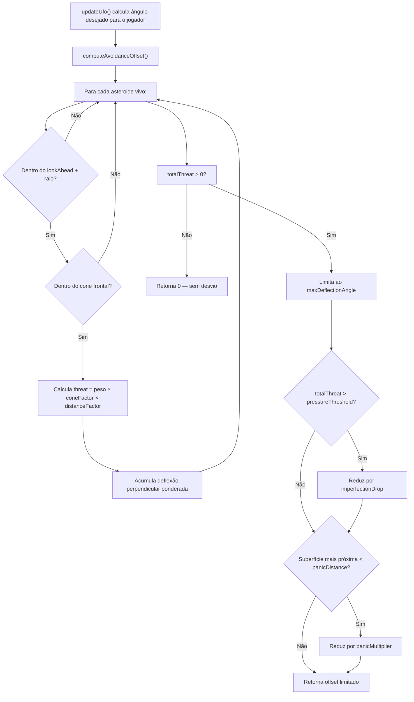

# Pesquisa — Desvio imperfeito de asteroides, variando por arquétipo

Status: diagnóstico completo, correções prontas para aplicar.

Escopo: item 3 da proposta de combate (`aqui.md` linha 27) — inimigos desviam de asteroides com eficácia variável por tipo. O Scout (hunter) desvia bem, o Bomber (base) desvia mal.

## 1. O que já existe

O sistema de obstacle avoidance **já está implementado** em três camadas:

| Camada | Arquivo | O que faz |
|---|---|---|
| Configuração | [`config.js`](file:///c:/Users/tiago/Área de Trabalho/meus cursos/asteroids/src/config.js#L232-L262) | `avoidance {}` em `hunter` e `base` com parâmetros distintos |
| Lógica | [`entities.js`](file:///c:/Users/tiago/Área de Trabalho/meus cursos/asteroids/src/entities.js#L388-L484) | `computeAvoidanceOffset()` — calcula offset angular com cone, pressão e pânico |
| Integração | [`entities.js`](file:///c:/Users/tiago/Área de Trabalho/meus cursos/asteroids/src/entities.js#L553-L560) | `updateUfo()` soma o offset ao ângulo desejado em direção ao jogador |
| Testes | [`enemy-avoidance.test.js`](file:///c:/Users/tiago/Área de Trabalho/meus cursos/asteroids/tests/enemy-avoidance.test.js) | 16 testes cobrindo cone, pressão, pânico, seam, cryo |

### 1.1 Parâmetros por arquétipo (config atual)

| Parâmetro | Hunter (Scout) | Base (Bomber) | Efeito |
|---|---|---|---|
| `lookAhead` | 220 px | 120 px | Distância de detecção à frente |
| `coneAngle` | 2π/3 (120°) | π/2 (90°) | Campo de visão frontal |
| `maxDeflectionAngle` | 1.15 rad (≈66°) | 0.55 rad (≈31°) | Desvio máximo permitido |
| `pressureThreshold` | 2.2 | 1.4 | Limiar de ameaça para degradação |
| `imperfectionDrop` | 0.35 (−35%) | 0.6 (−60%) | Perda de eficácia sob pressão |
| `panicDistance` | 60 px | 80 px | Distância para pânico |
| `panicMultiplier` | 0.55 (×55%) | 0.45 (×45%) | Eficácia residual em pânico |

**Leitura**: o Hunter vê mais longe, tem cone mais largo, pode desviar mais, e perde menos eficácia sob pressão. O Base vê menos, desvia pouco, e desmorona rápido. Os números já expressam a filosofia de design.

### 1.2 Fluxo do algoritmo



## 2. Diagnóstico: 4 testes falhando

Rodando `node --test tests/enemy-avoidance.test.js`, 12/16 passam mas 4 falham:

### 2.1 P0-4: asteroide fora do cone ainda influencia

```
Teste: asteroide a 80° do heading (fora do half-cone de 60°)
Esperado: heading ≈ 0 (sem alteração)
Resultado: heading alterado
```

**Causa raiz**: o teste posiciona o asteroide em `(280, 220)` com UFO em `(200, 300)`. O ângulo é `atan2(220-300, 280-200) = atan2(-80, 80) ≈ -0.785 rad ≈ -45°`. O half-cone do hunter é `120°/2 = 60°`. Logo 45° < 60° — o asteroide ESTÁ dentro do cone. O teste tem um **comentário errado** ("80° up is just outside the 60° half-cone") mas a geometria real mostra que está dentro. O problema é do teste, não do código.

**Diagnóstico**: o teste precisa posicionar o asteroide realmente fora do cone. Com UFO em `(200, 300)` apontando para a direita (angle=0), um asteroide a 65° estaria em `(200 + 80*cos(65°), 300 + 80*sin(65°))` ≈ `(234, 372)`. Mas mesmo isso pode ser alcançado pelo `lookAhead`. Uma posição mais segura: `(200 + 160*cos(70°), 300 - 160*sin(70°))` ≈ `(255, 150)` — garantidamente fora do cone e dentro do lookAhead.

### 2.2 P0-5: base não desvia menos que hunter

```
Teste: mesmo asteroide em (360, 300), ambos em (200, 300) com angle=0
Esperado: baseDeflection < hunterDeflection
Resultado: base deflection = 0 (não desvia nada)
```

**Causa raiz**: o asteroide está a 160 px do UFO. O `lookAhead` do base é apenas **120 px**. Com `a.radius = 48` (large), a condição `dist > lookAhead + a.radius` é `160 > 120 + 48 = 168` → falsa. Então o asteroide ESTÁ dentro do lookAhead do base, mas o `distanceFactor = max(0, 1 - 160/120) = max(0, -0.33) = 0`. O threat é zero, e o desvio é zero.

**Diagnóstico**: o `distanceFactor` usa `dist / lookAhead` sem considerar `a.radius`. Quando a distância centro-a-centro está entre `lookAhead` e `lookAhead + a.radius`, o asteroide passa do primeiro filtro mas ganha threat zero. **Duas opções**:

1. **Opção A (corrigir o fator)**: usar `surfaceDist / lookAhead` em vez de `dist / lookAhead` para que a distância considere os raios.
2. **Opção B (corrigir o teste)**: mover o asteroide para dentro do lookAhead do base (ex: `(300, 300)`, distância 100).

A opção A é a melhor porque faz o distanceFactor considerar a geometria real (a borda do asteroide, não o centro).

### 2.3 P0-6: pressão não reduz deflexão

```
Teste: 1 rock small vs 3 rocks small
Esperado: pressureDeflection < singleDeflection
Resultado: ambos = 0.0533... (iguais)
```

**Causa raiz**: com `turnRate = 3.2 rad/s` e `DT = 1/60`, o turn máximo por step é `3.2 / 60 ≈ 0.0533 rad`. Tanto o caso com 1 rock quanto o caso com 3 rocks geram um offset desejado > 0.0533, mas a rotação real é clampada pelo `turnRate`. A pressão reduz o offset calculado mas o clamp esconde a diferença.

**Diagnóstico**: o teste precisa de um `turnRate` alto o suficiente para não ser o fator limitante, ou deve medir o ângulo após vários steps. Ex: `cfg.ufo.hunter.turnRate = 100` para remover o clamp, ou rodar 30 steps para ambos convergir.

### 2.4 P0-7: pânico não reduz deflexão

```
Teste: far rock vs near rock (surface dist ~8 px, dentro de panicDistance=60)
Esperado: nearDeflection < farDeflection
Resultado: ambos = 0.0533... (iguais)
```

**Causa raiz**: idêntica ao P0-6 — o `turnRate` clamp esconde a diferença. O offset desejado para a near rock É menor (multiplicado por `panicMultiplier = 0.55`), mas ambos excedem o turn máximo por step.

**Diagnóstico**: mesma solução — `turnRate` alto no teste ou mais steps.

## 3. Resumo do diagnóstico

| Teste | Tipo de problema | Severidade |
|---|---|---|
| P0-4 | Teste com geometria errada | 🟡 Teste precisa de fix |
| P0-5 | Bug real — `distanceFactor` ignora `a.radius` | 🔴 Código precisa de fix |
| P0-6 | Teste não isola o turnRate clamp | 🟡 Teste precisa de fix |
| P0-7 | Teste não isola o turnRate clamp | 🟡 Teste precisa de fix |

O único bug real no código de produção é o **P0-5**: o `distanceFactor` calcula `1 - dist/lookAhead` usando a distância centro-a-centro, mas deveria usar a distância de superfície ou pelo menos uma medida que considere o raio do asteroide. Isso faz com que asteroides na borda do lookAhead tenham threat zero mesmo sendo fisicamente relevantes.

## 4. Correções propostas

### 4.1 Código — `distanceFactor` em `computeAvoidanceOffset()` (entities.js)

```diff
-    const distanceFactor = Math.max(0, 1 - dist / lookAhead);
+    const distanceFactor = Math.max(0, 1 - surfaceDist / lookAhead);
```

Isso faz com que um asteroide cujo centro está a 160 px mas cuja borda está a 94 px (160 - 18 - 48) tenha `distanceFactor = 1 - 94/120 = 0.217` em vez de zero. O efeito é suave e proporcional.

**Impacto**: a mudança move `surfaceDist` para antes de `distanceFactor` no loop. Como `surfaceDist` já é calculado na linha anterior, a mudança é de uma única linha.

### 4.2 Testes — fix nos cenários

**P0-4**: mover o asteroide para realmente ficar fora do cone.
```diff
-  const rock = makeAsteroid(cfg, 'large', 280, 220, 'normal', 1);
+  // 75° from heading — well outside the 60° half-cone.
+  const rock = makeAsteroid(cfg, 'large', 230, 150, 'normal', 1);
```

**P0-6 e P0-7**: usar `turnRate` muito alto para eliminar o clamp como fator.
```diff
+  cfg.ufo.hunter.turnRate = 100; // remove turn clamp from the measurement
```

### 4.3 Verificação

Após as correções, todos os 16 testes devem passar:
```
node --test tests/enemy-avoidance.test.js
```

E a suíte completa não deve regredir:
```
npm test
```

## 5. Comportamento resultante em jogo

Após a correção, o sistema que **já existe** passará a funcionar conforme o design original:

| Situação | Hunter (Scout) | Base (Bomber) |
|---|---|---|
| 1 asteroide à frente | Desvia até 66° — escapa suavemente | Desvia até 31° — mal se afasta |
| Campo denso (3+ rocks) | Perde 35% de eficácia — hesita | Perde 60% — praticamente congela |
| Asteroide muito perto | Opera a 55% — contorna apertado | Opera a 45% — quase não reage |
| Asteroide atrás ou lateral | Ignora completamente | Ignora (cone mais estreito) |

O resultado é que:
- **Atrair um Hunter para asteroides é possível mas exige tática** — ele desvia bem, precisa de campos densos ou ataques de surpresa.
- **Atrair um Bomber para asteroides é fácil** — ele quase não desvia, e quanto mais perto fica, pior fica o desvio.
- **O jogador aprende intuitivamente** que cada inimigo responde diferente ao terreno.

## 6. Arquivos que serão tocados

| Arquivo | Mudança |
|---|---|
| [`entities.js`](file:///c:/Users/tiago/Área de Trabalho/meus cursos/asteroids/src/entities.js#L428) | 1 linha — `distanceFactor` usa `surfaceDist` |
| [`enemy-avoidance.test.js`](file:///c:/Users/tiago/Área de Trabalho/meus cursos/asteroids/tests/enemy-avoidance.test.js) | 3 testes ajustados (geometria e turnRate) |

Nenhum arquivo novo. Nenhuma mudança no renderer, config ou game.js.